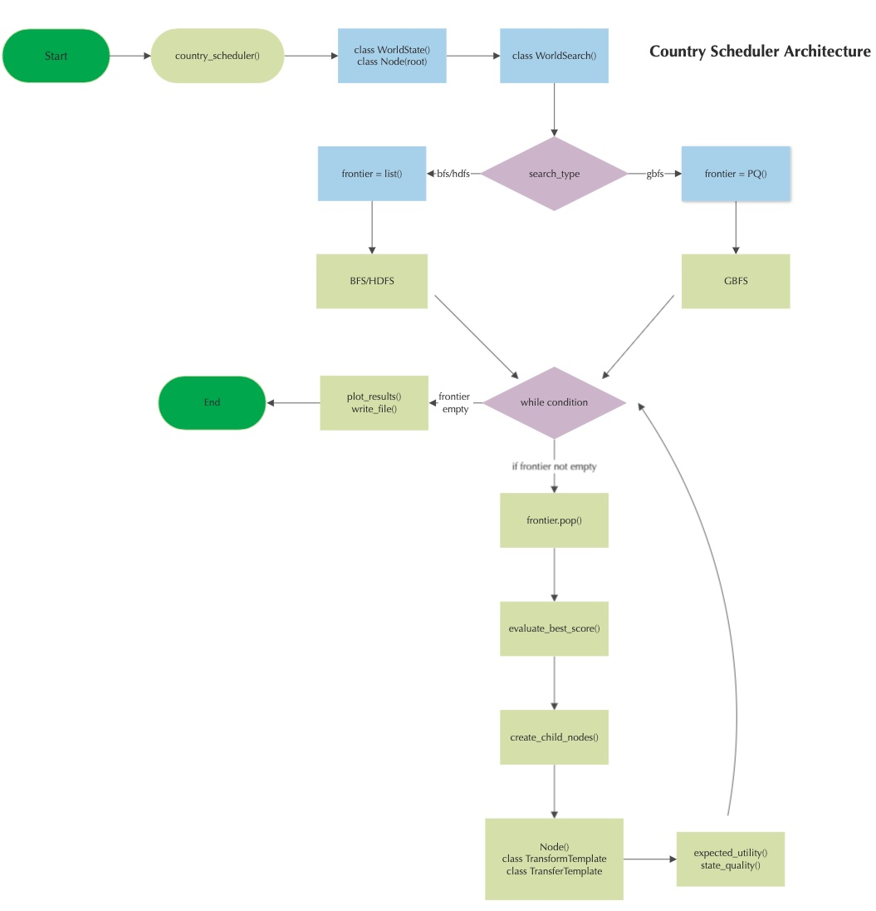

# CS 5260 - Artificial Intelligence
This repository contains the Project requirements for Artificial Intelligence class in Spring 2023 for the 
MS. of Computer Science program of Vanderbilt University.

by: Kevin Offemaria


## Project Requirements
The project requirements and relevant information are found in the directory: 
[project_reqs](project_reqs).

### Part 2 Submission Files
For the required project submission documents, see dir: [submission_files/part2](submission_files/part2).
- `test_cases_summary_part2.pdf`
- `country-sched-architecture.jpg`
- `CS5260_AI_koffemaria_part2.pptx`
- `video_link_part2.txt`

For part 1, see [submission_files/part1](submission_files/part1).


### Part 2 Notable Updates
#### Fixes from Part 1:
1. Correct implementation of [Greedy Best First Search](https://github.com/koffemaria2u/cs5260_ai/blob/d95cb854dee1a95465383d6495b7720df8e529fc/src/world_search.py#L217) 
using PriorityQueue.
   - Pointing out that [inverting EU scores is correct](https://github.com/koffemaria2u/cs5260_ai/blob/part2/src/world_search.py#L226) 
   in my original part 1 implementation.
2. Removed human intuition from [resource weights](src/input_files/world_resources_1.csv).
3. Fixed a bug from on the Transform template was doing unnecessary looping for all countries, but [we only care about 
Transforms of the `self.country`](https://github.com/koffemaria2u/cs5260_ai/blob/part2/src/world_search.py#L304). 
As a result on `evaluate_best_score()`, we only need to evaluate the EU score of our own self country.
4. [Shuffling of child nodes](https://github.com/koffemaria2u/cs5260_ai/blob/d95cb854dee1a95465383d6495b7720df8e529fc/src/world_search.py#L246) before being evaluated for their EU scores.
5. Add [plots](https://github.com/koffemaria2u/cs5260_ai/blob/d95cb854dee1a95465383d6495b7720df8e529fc/src/util.py#L149) 
and [summary schedules](https://github.com/koffemaria2u/cs5260_ai/blob/d95cb854dee1a95465383d6495b7720df8e529fc/src/util.py#L52)
for more efficient analysis.

#### New features:
1. [Random encounters](https://github.com/koffemaria2u/cs5260_ai/blob/part2/src/base_classes.py#L211) on applied on 
Transfer template to add more uncertainty on this action with a chance for both positive or negative effects.
2. A [chance to recycle](https://github.com/koffemaria2u/cs5260_ai/blob/d95cb854dee1a95465383d6495b7720df8e529fc/src/base_classes.py#L392) 
applied during Transform templates to recover a small percentage of raw resources used.
3. Increased complexity of [State Quality](https://github.com/koffemaria2u/cs5260_ai/blob/part2/src/world_search.py#L470)
by adding a cap on `Electronics` to satisfy a country's population and slightly increasing a priority for population `Housing`. 
4. A [concept of entropy](https://github.com/koffemaria2u/cs5260_ai/blob/part2/src/base_classes.py#L86) is implemented 
in the form of decaying resources using tiers of node count as the timestep.
5. Implemented two new search strategies to the game, [Heuristic Depth First Search](https://github.com/koffemaria2u/cs5260_ai/blob/part2/src/world_search.py#L97)
and [Breadth First Search](https://github.com/koffemaria2u/cs5260_ai/blob/part2/src/world_search.py#L162).


## Country Search Scheduler
### State Quality
[Fallout](https://fallout.fandom.com/wiki/Fallout_2) is based on a post-apocalyptic world, 
and Electronics as a whole is considered to be it's the most valued produced resource.
Intrinsically, Electronics can be defined as anything from radios, automobiles, firearms, etc. 

In terms of the State Quality definition, a country values its happiness according to how much `Electronics` it 
currently owns. Therefore, its State Quality measure is the count of the amount of available Electronics.
Since Electronics is a produced resource, there is value in having the necessary raw materials to produce them though
it would still need resources and time to produce them. This continuity of production is counted towards the SQ
score but with a 50% penalty. All of these are reflected in the [resource weights](src/input_files/world_resources_1.csv)
There is a cap on Electronics against the country's population assumed at a 2:1 ratio of Electronics per person.
If a country has more Electronics against its own population, we penalize Electronics, MetallicElements, MetallicAlloys.
This is necessary to shift focus on other resources that may potentially increase population satisfaction 
such as `Housing`, which has an increased role in EU contribution. We assume the optimal ratio of persons to a house is
4:1, or 4 persons per single house. A bonus to this resource is applied to incentivize building houses to accommodate
a country's population. However, just like Electronics, once the limit goes above the ratio a penalty will be applied
to discourage building unnecessary houses for a satisfied population. 

Finally, there is a small bonus applied to recycling `ElectronicsWaste` due to the scarcity of resources in the
barren wasteland. We assume [~17% of e-waste is recycled](https://www.genevaenvironmentnetwork.org/resources/updates/the-growing-environmental-risks-of-e-waste/) contributing positively to EU score.
 

[Logistic function](https://en.wikipedia.org/wiki/Logistic_function) constants:
- `x` is the input or independent variable
- `L` is the maximum value of the function
- `k` is the logistic growth rate or steepness of the curve
- `x_0` is the x-value of the sigmoid's midpoint


### Search Algorithm
There are 3 search functions that can be used in the program: Greedy Best First Search, Heuristic Depth First Search, 
Breadth First Search. GBFS utilizes the PriorityQueue class from the Python library, queue, as the storage frontier. 
While the others use the built-in Python List object. The algorithm of all three functions is generally the same
whereby they start with a root node inserted into the frontier and generate children nodes based on a root 
or parent node. It then attempts to generate Action Templates for TRANSFORMs and TRANSFERs. 
The resource values for the current node’s country are modified by the Action. The new child nodes are randomly 
shuffled and appended to the frontier. Next, the Expected Utility score on the current node is calculated
and evaluated against the best scoring EU node. If so, replace the best EU node with the current node, 
and write all the Action Templates for all parent nodes of the current node. The program ends when the maximum depth, 
or frontier size has been exceeded, or the frontier is empty. See diagram below.


### Country Schedule Architecture



#### Test Case Results
Test Case Results can be found [here](src/output_files/result_graphs).

## Usage
### Installation
To install the project requirements:

```bash
# install python virtual environment
pyenv virtualenv 3.10.1 venv_name
pyenv activate venv_name

# install reqs file
pip install -r requirements.txt
```

### Running the Program
The main program is the `country_scheduler.py`. Many of the arguments have default values, so you may invoke the module
without passing any parameters.
Run this from the top level directory as follows:

```bash
# run with default args
python src/country_scheduler.py

# run with custom args
python src/country_scheduler.py 
  --country-self NewCaliforniaRepublic 
  --resource-file src/input_files/world_resources_1.csv
  --state-file src/input_files/world_state_1.csv
  --output-file src/output_files/bfs_results
  --search_type gbfs # choices=["bfs", "hdfs", "gbfs"]
  --num-schedules 20
  --depth-bound 20
  --frontier-size 10000
  --loglevel INFO
```

### Around the repo
1. Test Results are found in the [output_files](src/output_files)
   - The last few characters of the file name indicate the test case and iteration (eg. `bfs_res...test1a.txt`)
2. Initial states are found in [input_files](src/input_files)
3. Main program in `src/` dir
   - entrypoint: `country_scheduler.py`
4. `submission_files/` contain the summary files as advised the project requirements.

### Directory Structure
```
├── project_reqs
│   ├── Part1
│   ├── Part2
├── src
│   ├── input_files
│   │   ├── world_resources_1.csv
│   │   ├── world_state_1.csv
│   ├── output_files
│   │   ├── result_graphs
│   │   ├── result_plots
│   ├── base_classes.py
│   ├── country_scheduler.py
│   ├── world_search.py
│   ├── util.py
├── submission_files
│   ├── part1
│   ├── part2
├── README.md
├── README_notes.md
├── requirements.txt 
└── .gitignore
```

## Citations
Class community citations:
- John Ford – Concept of [Resource decay](https://piazza.com/class/lbpfjbrwi0ca3/post/22)
- Karely Rodriguez – Proper implementation of [HDFS, alpha-beta pruning](https://github.com/karelyrodri/AI_Virtual_World/blob/main/Search_Strategies/HeuristicDepthFirstSearch.py#L34)

Online citations:
- [E-waste recycling](https://www.genevaenvironmentnetwork.org/resources/updates/the-growing-environmental-risks-of-e-waste/)
- [Fallout Random Encounters](https://fallout.fandom.com/wiki/Fallout_2_random_encounters)
- [Greedy Best First Search](https://www.youtube.com/watch?v=dv1m3L6QXWs)
- [Depth First Search](https://www.youtube.com/watch?v=pcKY4hjDrxk&t=730s)
- [Breadth First Search](https://www.youtube.com/watch?v=pcKY4hjDrxk&t=252s)
- [Metals deterioration](https://xapps.xyleminc.com/Crest.Grindex/help/grindex/contents/Metals.htm)
- [Timber decay](https://www.fs.usda.gov/research/treesearch/7717)


## Professor Feedback
Grade: 92

1. I appreciate that you took the Part 1 comments and critiques and really did a good job of addressing each of 
the issues...each of the items of concern looks much better in this submission, so thank you for taking the time to 
address those. I hope that in making some of those changes, you were able to see an improvement in your agent's 
behavior and understand why they were needed.
2. In your updated State Quality function, you say that the value is penalized if it goes above a certain ratio 
threshold...how is this penalization encoded (i.e., is it still a continuous function where the maximum value of the 
function is located at the target ratio, or is this a discontinuity whereby after the target ratio is reached, the state
quality suddenly jumps to a lesser or negative value)? Hint: continuous is always better, oftentimes even required.
3. You still keep referring to many of your choices as "incentivizing the AI to XXX", where XXX is something like 
"search through transfers instead of transforms"...this submission is much better than Part 1 at keeping your human 
intuition out of it, but it seems like you are still trying to push your AI to behave in a certain way and/or 
certain order. Remember, the purpose of AI is NOT to make the AI behave in the same way as a human...it's for it to 
come up with logical actions based on a desired goal/outcome. I know those two statements sound similar, but 
they're not saying the same thing. In your specific case, you shouldn't care at all HOW your agent ends up increasing 
its EU (i.e., what actions it takes in what order), the ONLY thing you are trying to do is to ensure that at the 
end of the day, your agent has come up with a world state that is "good" based on your state quality function. 
If you ever catch yourself thinking "I'd like to incentive my AI to ....", then whatever you're about to do is 
probably not going to have the intended effect and will also remove much of the "intelligence" part of the AI.
4. I like your Greedy Best-First Search results...the shape of the outcome for the EU values seems reasonable 
(with some significant growth up front that seems to lead to diminishing returns later on). And your explanation 
of why GBFS tends to lead to higher EU values very quickly is spot-on.
5. I also really enjoyed seeing the comparison of GBFS for your two country initial states...it was cool that 
they were both able to get up to similar final EU values although in very different ways...neat result and analysis. 
Your explanation of why you sometimes see big jumps in EU also makes sense to me based on the randomness of the 
trade percentage in your implementation. I actually think this is a good implementation detail (since it allows 
your AI to search different parts of the search space randomly without any guidance or intuition), and I think that 
if you had been able to continue searching to much deeper depths (like hundreds or thousands), this detail would 
have been a huge factor in ensuring that your AI is able to continue improving its EU pretty substantially over a 
significant period of time.
6. In your "resource decay" explanation, you mention that it is tiered based on node count (and you mention many 
thousands of nodes in each tier). Why are you using node count for resource decay vs. node depth? If I'm correct in 
assuming that node count is equal to the number of nodes that have been added to the frontier, then I'm not sure 
that this metric makes sense...this would penalize actions that get added to the frontier at a later time, even if 
they are only ACTUALLY the second or third action that would be present in a schedule, for example. 
Resource decay shouldn't have to do with the length of your search, but rather the length of your schedule.
7. Good analysis of the limitations of Heuristic-DFS, this is always problematic when using this search strategy 
on very large/infinite search spaces.
8. I also like your analysis of the limitation of the Breadth-First Search strategy - from your results, it 
looks like it was JUST starting to begin an exponentially increasing growth rate in EU, so it would have been very 
interesting to see what EU values it was able to find if it could have searched to say a depth of 100 
(vs. a similar depth using Greedy Best-First Search). You hit the nail on the head on why BFS is rarely used for 
problems like this with large branching factors, but nonetheless, BFS does guarantee that the actually optimal 
solution will be found (if you had infinite resources and time), so it's cool to compare these results to 
Greedy Best-First Search just to see how much of a tradeoff there is for gaining speed vs optimality.
9. The little extra features you added to your agent are really cool (EcoWaste recycling, randomness of 
action choice, etc.)!
10. One note, alpha-beta pruning definitely does NOT add human intuition to the agent. The only thing alpha-beta 
pruning does is to remove paths from the search tree that are GUARANTEED to be worse than something that has 
already been explored. And it does this in a mathematically sound way (with no knowledge of the meaning behind 
what it's doing).
11. Very good explanation during your Test Cases summary. I think you've made a ton of progress in this course 
and especially since project Part 1. The only thing that you still try to do is to guide your AI in certain ways 
that aren't advisable, but I think you'll be able to overcome this with more exposure and practice. It's definitely 
not a natural thing to program in this way, but you've made GREAT progress!
12. By the way, thank you so much for adding the links in the GitHub repo that go to specific areas in your code. 
This was super helpful to see exactly what you were referring to in your presentation.